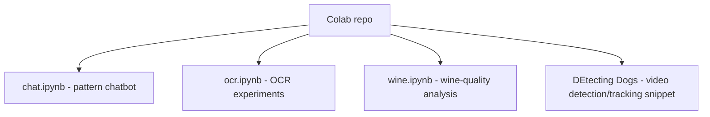

# Colab

## Problem
This repository is not a single production system; it is a collection of Google Colab experiments for learning and prototyping across three different ML tasks:
- rule-based conversational chat
- OCR from images
- wine-quality classification and analysis

## System Design

- Architecture:
  - [`chat.ipynb`](C:\Users\91965\cars24\github-readme-batch\Colab\chat.ipynb) contains an NLTK-based rules chatbot experiment with some extra NLP package installation cells
  - [`ocr.ipynb`](C:\Users\91965\cars24\github-readme-batch\Colab\ocr.ipynb) compares OCR workflows using OpenCV, Tesseract, thresholding, and EasyOCR
  - [`wine.ipynb`](C:\Users\91965\cars24\github-readme-batch\Colab\wine.ipynb) loads the UCI wine-quality datasets and explores them in Pandas / TensorFlow
  - [`DEtecting Dogs`](C:\Users\91965\cars24\github-readme-batch\Colab\DEtecting%20Dogs) is a standalone OpenCV snippet for dog detection and tracking in video
- Components:
  - LLM: none
  - DB: none
  - APIs: none
  - execution model: interactive notebooks in Colab rather than an application server

## Approach
- Why multi-agent?
  - Multi-agent is not used. Each notebook is a self-contained exploratory workflow for one ML task.
- Why RAG?
  - RAG is not used because these experiments are based on direct models, OCR pipelines, or tabular analysis rather than document retrieval.
- What makes this repo distinct:
  - it is a sandbox for learning-by-building
  - each notebook explores a different modality: text, images, or tabular data
  - the repo keeps raw experimentation history rather than packaging everything into a single deployable app

## Tech Stack
- Google Colab / Jupyter notebooks
- Python
- NLTK
- spaCy
- OpenCV
- Pytesseract
- EasyOCR
- Pandas
- NumPy
- TensorFlow

## Demo
- Open the notebook directly in Colab from the badge at the top of each `.ipynb`
- Chat notebook:
  - install NLTK
  - define regex-style conversation pairs
  - run an interactive terminal chatbot loop
- OCR notebook:
  - load an image
  - preprocess it with thresholding
  - extract text with Tesseract or EasyOCR
- Wine notebook:
  - load the red and white wine datasets
  - merge, inspect, and prepare the data for modeling

## Results
- This repo is best understood as an experimentation log, so the main output is learning velocity rather than a single benchmark.
- Concrete outcomes visible in the code:
  - working OCR exploration with preprocessing and text-box extraction
  - a basic chatbot prototype using NLTK reflections and response pairs
  - a tabular ML notebook around the wine dataset
  - an initial dog detection/tracking script

## Learnings
- What worked:
  - Colab made it easy to try several ML ideas quickly without building full project scaffolding
  - keeping separate notebooks for separate problems preserved context for each experiment
  - the OCR notebook shows a useful progression from raw extraction to preprocessing-enhanced extraction
- What did not:
  - the repo does not yet have a unifying project structure, reproducible environment file, or shared documentation
  - some artifacts are notebook-only and not packaged into reusable scripts
  - the dog-detection file looks like a partial snippet rather than a full runnable pipeline

## Supporting Docs
- [Architecture diagram](docs/architecture.png)
- [Evaluation logs and outputs](docs/evaluation.md)
- [Sample inputs and outputs](docs/sample_io.md)
